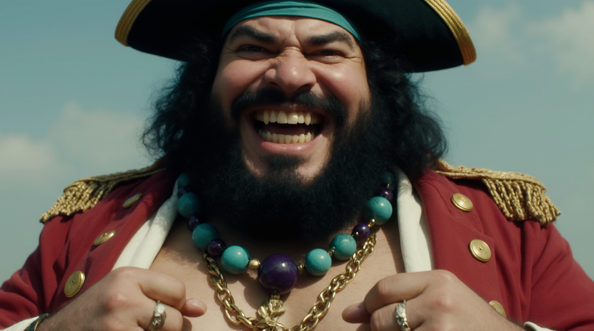

# 📖 Guide: Mastering Prompting for Imagen4, Flux kONTEXT Max, SeeDream, runway Gen-4 Image

Welcome to **Mastering Prompting for Imagen4**! This guide will help you craft high-quality prompts to generate stunning visuals using the **Imagen4 model by Google**. Whether you're a beginner or looking to refine your skills, this guide is packed with examples, tips, and a glossary to make your journey easier.

You can access the tool here: [Google Image FX](https://aitestkitchen.withgoogle.com/fr/tools/image-fx)

## 🤔 A Few Things to Keep in Mind

Before we dive in, it's important to understand a few things about how image generation models work and to be aware of some common misconceptions.

*   **Not all images are created equal:** Some images are inherently harder to generate than others. A model might excel at creating portraits but struggle with complex scenes with multiple subjects.
*   **The "Best-of" bias:** Providers and users often showcase their best results, which can create a skewed perception of a model's capabilities. It's important to remember that you are often seeing the highlights, and not the average result.
*   **The power of the dataset:** Image and video generation models are trained on vast datasets of images. However, these datasets are not uniformly distributed. For example, images of a person walking down the street are much more common than images of a knight riding a dragon. This distribution influences the model's ability to generate certain types of images.
*   **Style bias:** A scene can be strongly associated with a particular style in the training data. For instance, scenes from Tolkien's Silmarillion are more likely to be associated with book illustrations than with a cinematic, IMAX-style scene. This can make it challenging for the model to generate images in a style that is not well-represented for a given subject in its training data. This is why it is sometimes difficult to generate things that don't "already exist" in a way in the training data.
*   **What does it mean to "create"?** The question of whether AI models "create" art is a fascinating one, and it echoes a debate that dates back to ancient Greece. For Plato, art was a form of *mimesis* (imitation), but he saw it as a mere copy of the physical world, which was itself a copy of a higher reality of "Forms". In this view, art is twice removed from the truth. Aristotle also saw art as mimesis, but for him, it was a creative act of "recomposing" elements from nature to reveal deeper, universal truths.

    This ancient debate provides a powerful lens through which to understand modern generative models. Like Plato's artist, a generative model is, in a sense, "copying" from the vast dataset of images it has been trained on. It operates within a high-dimensional space that is entirely constrained by this data. However, like Aristotle's artist, the model can also be seen as "recomposing" these existing elements in novel ways to create something that has never been seen before. It can blend styles, combine objects, and generate new compositions based on the statistical patterns it has learned.

    So, while a generative model doesn't "create" in the human sense of the word, it does more than just copy. It navigates a complex space of possibilities, guided by a prompt, to produce a new image that is a "recomposition" of what it has learned. This is why it is sometimes difficult to generate things that don't "already exist" in some form in the training data.

## 🌟 Table of Contents
1. 🎯 **Introduction to Prompting**
2. 💡 **Sample Prompts for Inspiration**
    - Prompt 1: Mysterious Creature
    - Prompt 2: Samurai Thanos
    - Prompt 3: Steampunk Naval Base
    - Prompt 4: Tree Cutting in a Citadel
    - Prompt 5: Battle of Beleriand
    - Prompt 6: Space Vessel Escape
    - Prompt 7: Enchanted Garden Scene
    - Prompt 8: Samurai Tension in the Mist
    - Prompt 9: Futuristic Alien Robot
    - Prompt 10: Epic Warrior in Fantasy Landscape
3. 🎬 **Cinematic Effects & Jargon**  
4. 📘 **Final Tips for Crafting Effective Prompts**

---

## 🎯 **Introduction to Prompting**

When generating images using AI models like Imagen4, the quality of your prompt is crucial. A well-structured prompt provides clear, vivid details that guide the model in rendering the best possible output. 

### 🤔 How to Structure a Good Prompt:
1. **Clarity and Specificity**: The more specific your prompt, the better. Describe the scene, lighting, and style with precision.
2. **Imagery**: Use vivid and descriptive language to evoke clear visuals.
3. **Style and Mood**: Mention artistic styles, color palettes, or moods to set the tone of the image.
4. **Action and Perspective**: Describe what’s happening in the scene and from which angle or viewpoint.

---

## 💡 **Sample Prompts for Inspiration**

Here’s a collection of high-quality prompts you can use or modify to fit your vision. Each one showcases different themes, from fantasy creatures to cinematic action scenes.

### 👽 Prompt 1: Mysterious Creature
*a high-resolution, macro-style photograph of a strange, vaguely humanoid creature, approximately 3 meters tall, shot from a 45-degree angle, with a shallow depth of field, focusing on the creature 's extremely elongated skull and razor-sharp claws. The creature stands upright on two legs, curved backward in an unnatural posture, with a skeletal thoracic cage visible beneath its white porcelain carapace. The carapace is adorned with intricate blue paintings, and multiple long, pointy spikes protrude from its vertebral column. Its eyes appear white, cloudy, and lifeless, adding to the creature 's menacing appearance. A French countryside field serves as the background, with splendid sun light, creating stunning reflections on the porcelain exoskeleton accentuating the texture and detail, reminiscent of a professional wildlife photography shot.*

### ⚔️ Prompt 2: Samurai Thanos
*Cinematic, high-quality photo of Thanos in a serene Japanese forest, clad in a traditional samurai armor made of white porcelain, adorned with intricate blue paintings that evoke the art of ancient Japanese ceramics. The armor's delicate, hand-painted designs seem to shimmer in the soft, dappled light filtering through the forest canopy. Thanos wields a heavy, curved katana with a worn, wooden scabbard, its blade gleaming with a subtle, deadly sheen. The scene is captured in a dramatic, close-up angle, with the misty forest atmosphere and the soft, golden light of dawn or dusk accentuating the armor's ethereal beauty, while the weight and power of the katana seem to anchor Thanos to the earth, ready to unleash his fury upon the world.*

### ⚙️ Prompt 3: Steampunk Naval Base
*A breathtaking, high-quality frame from an animated movie in the style of Studio Ghibli's steampunk universe, depicting a majestic naval base resembling a fortified stone citadel, with the words ' Marine ' emblazoned in bold, copper-plated letters on the front facade. The base's walls are a labyrinth of steam-powered machinery, copper pipes, and intricate clockwork mechanisms, with riveted steel plates and wooden accents adding to its industrial charm. A fleet of warships, each with its own unique steam-powered design, lies anchored in the harbor, their cannons and turrets at the ready. Airships and steam-powered dirigibles patrol the skies above, while a network of steam-powered cranes and pulleys facilitates the loading and unloading of cargo and supplies. The sea itself is a dazzling display of turquoise and azure hues, with sunlight dancing across the waves and a few wispy clouds drifting lazily across the sky amidst a trail of steam and smoke.*

### 🌳 Prompt 4: Tree Cutting in a Citadel
*An epic scene extracted from a blockbuster movie d epic ting men cutting down the trunk of a majestic white tree within a citadel The citadel, carved from brilliant white stone, features intricate architecture— graceful arches, statues, and cascading terraces. Splendid light bathes the scene, highlighting its grandiosity, contrasting with the solemn destruction of the tree.
The camera captures wide shots of the citadel 's vastness and close-ups of the men's effort. Muscular arms swing axes, sending shards of white bark fluttering to the ground. The perspective shifts with each swing, emphasizing the scale of the task.
Hyper-detailed VFX bring the scene to life— splinters glisten in sunlight, dust rises with each swing, fire burns with huge flames and fire particles in the citadel and subtle tremors run through the ground as the tree falls. Inspired by Peter Jackson's style, the visuals blend grandeur with intimate moments, showing both the struggle and the cost of progress*

### 🛡️ Prompt 5: Battle of Beleriand
* An epic scene from a high-quality blockbuster movie, depicting the fierce Battle of Beleriand. The elven leader, in shining armor, stands at the forefront of the battlefield, surrounded by chaos as Orcs and other servants of darkness clash with the elven forces. The battlefield is chaotic, with flashes of light from elven blades clashing against the dark weapons of the enemy. The elven leader's movements are swift and precise as he cuts down his foes, his voice echoing across the field. Dynamic camera angles capture the elven forces as they fight with determination, emphasizing their agility and unity amidst the darkness. Hyper-detailed VFX bring the battle to life— sparks flying from each clash of weapons, dust swirling around charging warriors, and arrows whistling through the air. Photorealistic rendering highlights the contrast between the radiant armor of the elves and the dark, twisted forms of their enemies, with intricate particle effects— bloodied earth, shattered weapons, and flashes of magic illuminating the battlefield. Inspired by Peter Jackson's cinematic style, the visuals are intense and immersive, drawing the viewer into this epic struggle between light and darkness.*

### 🚀 Prompt 6: Space Vessel Escape
*An epic, high-octane scene featuring a massive, kilometers-long spatial vessel shaped like a traditional Christian cross, with an elongated vertical branch and precise angles. The colossal vessel soars away from Earth, which glows magnificently in the background with vibrant blues and swirling clouds. Explosive VFX light up the vessel— glowing conduits, shimmering reflections, and intense thrusters firing as it departs into the dark void. The action is captured with sweeping, dramatic angles that highlight the vessel’s immense size against the vast beauty of space. Michael Bay-style visuals deliver intense, stunning effects, from glinting metal and dazzling energy trails to the dynamic movement of the majestic cross-shaped vessel leaving Earth in spectacular fashion.*

### 🌸 Prompt 7: Enchanted Garden Scene
*A breathtaking, hand-drawn frame from a Studio Ghibli masterpiece, showcasing an enchanting open-air garden bursting with life. The scene is a symphony of vibrant colors, with each blade of grass and leaf meticulously rendered. A towering man, 3 meters tall, reclines on an ornate sofa, his presence both whimsical and imposing. His blond hair shimmers with golden highlights, each strand individually animated to catch the light. His demonic smile reveals perfectly crafted teeth, adding a touch of menace to his otherworldly charm.
The man's coat is a marvel of animation, each pink feather lovingly detailed and shimmering with an iridescent glow that seems to dance in the sunlight. The play of light on the feathers creates a mesmerizing effect, with subtle hues of lavender and rose gold blending seamlessly. His red-tinted glasses gleam with hyper-realistic reflections, capturing miniature versions of the surrounding garden.
Behind him, a line of servants stands in perfect stillness, their expressions a study in subtle emotion. Each face is uniquely crafted, with minute details in their eyes and the set of their mouths hinting at hidden depths. The statues scattered throughout the garden seem alive, their marble surfaces catching and diffracting the light in impossibly beautiful ways.
The sky is a masterpiece of color gradation, transitioning from a deep, rich blue at the zenith to softer hues near the horizon. Clouds drift lazily, their edges softly blurred yet intricately detailed, casting gentle shadows that move across the landscape. The sunlight bathes the entire scene in a warm, golden glow, creating long shadows and highlighting every texture and surface with photorealistic precision.
Every element in the frame, from the smallest leaf to the grandest statue, is rendered with Studio Ghibli's signature attention to detail. The result is a living, breathing world that invites the viewer to step inside and explore its magical depths.*

### 🌫️ Prompt 8: Samurai Tension in the Mist
*A dramatic samurai scene in a misty bamboo grove: in a misty bamboo grove, battle-hardened samurai stand facing each other, their traditional armor catching the filtered sunlight. Their expressions shift between anger, fear, and fierce determination, their eyes sharp and intense as they engage in a tense discussion. The conversation is charged, emotions flickering across their faces—terror, frustration, rage, and an underlying sense of duty. The samurai's faces are a study in contrast: brows furrowed, mouths set in grim lines, and eyes wide with conviction.
High-contrast black and white cinematography in the style of Akira Kurosawa cinema, captures the dynamic composition, with diagonal bamboo lines and swirling mist adding tension. Telephoto lenses compress space, creating claustrophobic tension, while wide angles establish the grove's vastness. Silence dominates, broken only by the rustling of leaves and the strained voices of the samurai. The atmosphere is heavy, each pause in the conversation laden with meaning and anticipation.
Deep focus and axial cuts are used to intensify the exchange, bringing the viewer closer to the characters and their raw emotions. The scene embodies Kurosawa's meticulous blend of visual storytelling and atmospheric tension, capturing the depth of the samurai's internal conflict in a visually striking moment.*

### 🤖 Prompt 9: Futuristic Alien Robot
*breathtaking, high-quality photograph of an alien robot, its head inspired by high-tech motorcycle motors. The elongated head is composed of hundreds of intricate components, plastic, and wires, all in creamy white colors, resembling a high-tech futuristic product. The head's design includes detailed articulations, gears, and several plastic plates forming an exoskeleton. Many of the components feature tiny Japanese kanji inscriptions, resembling instructions on high-tech devices. The robot's structure also incorporates a myriad of cables and mini neon tubes with a pinkish glow. The head has high-tech protuberances and antennas, resembling the exoskeleton of insects or beetles, with multiple curved shapes and strange forms, all intricately detailed with numerous components. The robot, adorned with a sumptuous Japanese kimono, stands in a lush natural background. The scene captures the robot's intricate details, from antennas, high tech horns like insect ones, and protuberances  to the myriad components, evoking a sense of hyper-realism and complexity.*

### 🏞️ Prompt 10: Epic Warrior in Fantasy Landscape
*A stunning, high-resolution scene from a high-budget film captures a warrior clad in sumptuous, ornate armor inspired by Tolkien 's style. The intricately detailed armor reflects light brilliantly, showcasing elaborate engravings and gemstones that shimmer in the sun light. The warrior stands tall, exuding strength and determination, with a fierce gaze fixed on the horizon. 
He is positioned in a breathtaking landscape, surrounded by majestic mountains and lush forests, bathed in warm, golden light. The scene is enhanced by meticulous color grading that high light s the vibrant colors of the environment, utilizing LUTs to establish a powerful, epic atmosphere. Cinematic filters give the image a polished, Hollywood look, while color correction balances the visual elements for maximum impact.
The digital intermediate (DI) process ensures every detail shines, and film emulation techniques replicate the rich textures of analog film. A carefully curated color palette enriches the scene, while tone mapping adapts the range of colors and brightness for a stunning visual experience. Cinematic overlays subtly enhance the epic ambiance, capturing the essence of Peter Jackson's cinematic style in this breathtaking portrayal of valor and beauty.*

### prompt 11: 
*A movie scene still from a blockbuster fantasy film, set in a once-majestic elven citadel now engulfed in chaos, captured in a dynamic Close-Up Shot. The scene unfolds in the heart of the city, where towering flames lick at the sky, spreading rapidly and casting an intense, fiery glow over the once-peaceful courtyard. Splendid elven soldiers in ornate, gleaming armor engage fiercely in battle against a horde of snarling orcs, their twisted forms charging forward with brutish ferocity. The air is thick with swirling particles—embers, ash, and dust—creating a breathtaking yet haunting atmosphere filled with both beauty and destruction.

Brilliant flames illuminate the scene, casting flickering shadows that dance across the intricate stonework of the citadel, while the sound of clashing swords and the guttural war cries of the orcs echo through the chaos. The color palette is a dramatic blend of fiery oranges and reds contrasted with deep shadows, enhanced by "Kodak Vision3 500T" film stock to capture the raw intensity of the conflict. Shot at f/2.0, the shallow depth of field focuses on a valiant elven captain standing firm against the oncoming wave of enemies, their armor reflecting the glow of the flames as they prepare to defend their home.

As the scene unfolds, light leaks and optical flares from the raging fires create a mesmerizing visual effect, enhancing the feeling of a world on the brink of devastation. The atmosphere is charged with tension, as the elven defenders fight valiantly against the overwhelming onslaught of orcs, whose crude, dark armor contrasts sharply with the elven elegance. The viewer is thrust into this gripping moment, where the air is filled with the weight of impending loss, heroism, and the desperate fight to save a once-beautiful realm from engulfing darkness.*

### prompt 12:
*High-budget cinematic scene, Frostpunk aesthetic, Cinestill 50d tones, earthy neutrals, cinematic contour lighting. The camera angle is low and slightly tilted, emphasizing a towering robotic figure surrounded by a squad of modern troops in black tactical gear, each draped in burlap priest robes over their uniforms. The robot’s elongated head features intricate, insect-like carapace protrusions, with hundreds of milky white plastic micro-pieces, tubes, and cables that give it an otherworldly, organic appearance. Its amber-lit eyes cast a soft, eerie g low, while golden bionic horns rise from its crown, blending ancient Byzantine artistry with advanced technology. Clad in aged Byzantine armor and a burlap priest robe, the robot grips an immense wooden Christian cross, holding it as a symbol of power and purpose, towering over the marching troops. The whole scene takes places on an old paved road surrounded by ruins of an old greek city, ruins are barely visible in the mist*

### prompt 13:
*Cinematic aerial shot of a futuristic spaceship crashed in a lush mountain jungle Hyper-realistic, high-budget scene in Cinestill 50D film style, with soft, diffused lighting accentuating the details The scene unfolds with a majestic futuristic spaceship, constructed from multiple white plates and intricately adorned with golden Byzantine mosaics, dramatically crashed in a vibrant mountain jungle. The vessel’s sleek design contrasts against the lush greenery as vibrant vines and foliage envelop its structure, softening its sharp lines. In the foreground, mist swirls gently, creating a layer of depth that draws the viewer's eye towards the ship. Sunlight breaks through the dense canopy above, casting stunning god rays that filter through the mist and illuminate the jungle floor, enhancing the ethereal quality of the environment. Towering trees surround the ship, their roots intertwining with the wreckage, while the air is alive with the subtle movement of leaves, adding to the immersive atmosphere. The Frostpunk-inspired earthy neutral tones, combined with the striking interplay of light and shadow, create a hyper-realistic setting that beautifully merges advanced technology with nature’s reclamation, evoking a sense of lost grandeur and tranquility.*

### prompt 14:
Movie still. Medium shot, low angle, slightly high. A lone, muscular orc leader with a pale, bald head and scarred skin stands on a rocky outcrop. He raises a crude, spiked mace and a short sword above his head. He is wearing roughly-hewn bone armor over a leather and fur skirt. A vast orc army stretches behind him, covering a hilly, rocky landscape. Diffused daylight creates soft shadows; the light source is positioned above the scene. The terrain is a mix of dry, rocky dirt with low, sparse vegetation. The orc army is composed of thousands of similarly armored orc s holding spears, swords, and axes, some with crude banners and flags. Layered composition. The background shows distant, muted mountains. Shallow depth of field with the foreground orc leader sharply focused, the army in the middle ground slightly blurred and the background softly out of focus. Desaturated color pale tte with grays, browns, and muted greens dominant. Medium focal length lens. Cinematic look, slightly overcast atmosphere.

### prompt 15:
Immersive, hyperrealistic cinematic scene depicting a powerful shogun seated regally before an ancient, weathered stone Japanese temple. The shogun is clad in incredibly complex and detailed golden armor featuring intricate ornamentation, including sculpted golden dragons intertwined with detailed engravings. The armor gleams with a realistic, warm metallic luster. He wears a futuristic, large, and complex helmet of otherworldly design, crafted from hundreds of pieces of gold and smooth, white plastic, reminiscent of a high-tech Apple product, featuring several curved protrusions and two prominent golden deer horns. The helmet exhibits a pearlescent sheen and possesses intricate detailing, suggesting advanced, non-human technology. The shogun is flanked by an assembly of guards, each wearing similar helmets but with sleek, high-tech ninja attire made from dark, loose-fitting cloth, wielding kusarigamas with a realistic metallic sheen. The scene is captured using a dynamic, slightly low-angle, wide-angle perspective that emphasizes the shogun's authority and the imposing nature of the setting. The temple is made of detailed, moss-covered stone, with realistic textures and subtle signs of age. Employ dramatic, high-contrast, chiaroscuro-style lighting with volumetric god rays filtering through the surrounding environment, creating a mystical and dramatic atmosphere. Utilize advanced depth of field techniques to render the shogun and immediate surroundings in razor-sharp focus, while softly blurring the background, enhancing the cinematic feel. Render the scene with 8K resolution and incorporate subtle film grain for a realistic film texture. Employ advanced color grading with a focus on rich, warm tones to complement the gold armor, contrasted with the cool tones of the stone temple and the surrounding environment. Include subtle lens flares and chromatic aberration to add to the realism and cinematic quality.

### prompt 16:
Movie still from a 1980s sword and sorcery fantasy film, shot on 35mm film stock, exhibiting noticeable film grain and a 1.85:1 aspect ratio. The color palette leans towards a gritty, earth-toned aesthetic with desaturated hues, punctuated by specular highlights catching on sweat and metal. Depict a powerfully built man, his muscles glistening with moisture, reminiscent of a classic bodybuilder physique, wielding a large, ornate sword. He is positioned in a dimly lit cave environment, the background shrouded in soft-focus shadows, suggesting a rugged, ancient setting. The lighting is dramatic, employing chiaroscuro techniques, with hard light sources casting long shadows and emphasizing the textures of skin, stone, and steel. The overall mood should be one of grim determination and raw strength, characteristic of the fantasy films of that era.

### 🚫 Prompt 17: The Pitfall of Proper Nouns

A common mistake is to use proper nouns (like names of characters or places from fiction) when aiming for a realistic image. The model may have been trained on data where these words are associated with illustrations or specific art styles, which can prevent it from generating a photorealistic image. It's often better to describe the characteristics of the person or place you have in mind.

Here is an example of a prompt that uses a proper noun, and a better version that is more descriptive.

**Version 1 (with proper noun):**

*Leica M10, 50mm Summilux lens, cinematic scene. Capture an over-the-shoulder, close-up view from ground level, showing a Valyrian lord as he faces his impending doom. He stands tall, back to us, adorned in a white robe richly embroidered with gold, his long white hair flowing down his back, and a golden laurel wreath resting upon his head. The scene is epic, set against the backdrop of a massive lava meteor hurtling towards him, filling the frame with its fiery form and trailing smoke. He is standing on an antique stone-paved plaza, surrounded by marble statues, with the vast expanse of Valyria stretching out beyond. The sky is a stunning blue with a magnificent light, a stark contrast to the impending fiery doom. Use a shallow depth of field to focus on the lord and the meteor, with a slightly blurred background. Use dramatic chiaroscuro lighting, rich textures, 8K resolution, baroque painting meets Gucci style, high contrast, and film grain. The scene is ultra-realistic, capturing the lord's despair and the immense scale of the approaching cataclysm.*

**Version 2 (descriptive):**

*Leica M10, 50mm Summilux lens, cinematic scene. Capture an over-the-shoulder, close-up view from ground level, showing a lord from a glorious titanic city with Greco-Roman architecture as he faces his impending doom. He stands tall, back to us, adorned in a white robe richly embroidered with gold, his long white hair flowing down his back, and a golden laurel wreath resting upon his head. The scene is epic, set against the backdrop of a massive lava meteor hurtling towards him, filling the frame with its fiery form and trailing smoke. He is standing on an antique stone-paved plaza, surrounded by marble statues, with the vast expanse of the city stretching out beyond. The sky is a stunning blue with a magnificent light, a stark contrast to the impending fiery doom. Use a shallow depth of field to focus on the lord and the meteor, with a slightly blurred background. Use dramatic chiaroscuro lighting, rich textures, 8K resolution, baroque painting meets Gucci style, high contrast, and film grain. The scene is ultra-realistic, capturing the lord's despair and the immense scale of the approaching cataclysm.*

<table>
  <tr>
    <td></td>
    <td></td>
  </tr>
  <tr>
    <td align="center">Prompt with proper noun</td>
    <td align="center">descriptive without out of distribution proper noun</td>
  </tr>
</table>

## 🎨 Model Diversity: Same Prompt, Different Results

One of the most fascinating aspects of generative AI is that different models, even when given the exact same prompt, will produce vastly different results. This is because each model has its own unique training data, architecture, and fine-tuning, which gives it a distinct "artistic personality."

Here is a prompt that was used to generate images from four different models.

**The Prompt:**

> 35mm film look movie still, ARRI Alexa, Summilux lens: Hyperrealistic photography, photorealistic quality, cinematic grain. A dramatic, low-angle shot captures an immense, fat pirate figure dominating the frame, embodying raw, imposing power. He smiles menacingly, his face dominated by a long, hooked nose and a wide, gap-toothed grin revealing crooked, yellowed teeth. Thick unkempt black beard and hair spilling from beneath a black captain's hat and turquoise bandana. A voluminous, crimson captain's coat with intricate golden trim and epaulets is draped open over his bare, muscular chest. He wears multiple striking necklaces: one composed of large, lustrous green beads and another of gold links interspersed with deep purple discs. Rings adorn his fingers, and a bracelet graces his wrist. A swirling mass of inky dark mist radiates from one of its clenched fist, while the other fist is surrounded by a sphere of pure white light. The background is a sun-drenched, slightly blurred expanse, suggesting a vast, open battleground under a bright sky, with shallow depth of field keeping the colossal figure sharply in focus.

**Reference Image:**

**Model Outputs:**

<table>
  <tr>
    <td align="center">
      
       
      <b>Imagen4 Ultra</b>
    </td>
    <td align="center">
      
       
      <b>Midjourney v7</b>
    </td>
  </tr>
  <tr>
    <td align="center">
      
       
      <b>Krea</b>
    </td>
    <td align="center">
      
       
      <b>SeeDream 3</b>
    </td>
  </tr>
</table>

### Observations

*   **Imagen4 Ultra:** This model is the most faithful to the prompt in terms of content and requested elements (they are all there), but the visual style is less appealing.
*   **Midjourney v7:** This model does not respect all the elements of the prompt, but the artistic quality and colors are much better.
*   **Krea:** This model generates an ultra-realistic image worthy of a film, but it lacks the epic feel requested in the prompt.
*   **SeeDream 3:** This model has respected all the elements of the prompt and has an interesting and unique style.

## 🏆 Choosing the Best Models

Choosing the right model is crucial for generating high-quality images. Fortunately, there are leaderboards that rank models based on their performance. These leaderboards use a system called the Elo rating system to provide a relative ranking of the models.

### 📊 The Elo Rating System

The Elo rating system is a method for calculating the relative skill levels of players in two-player games such as chess. It's also used to rank AI models. The basic principle is that each model has a rating, and when two models are compared, the winner takes points from the loser. The number of points gained or lost is determined by the difference in the ratings of the two models.

If a lower-rated model wins against a higher-rated model, it will gain more points than if a higher-rated model wins against a lower-rated model. This system allows for a dynamic and fair ranking of models over time.

### 🔗 Leaderboards and Testing

Here are some resources to help you choose the best model for your needs:

*   **[LMSys Chatbot Arena](https://lmarena.ai/?chat-modality=image)**: This is a platform where you can test and compare different models for free. You can prompt two anonymous models side-by-side and vote for the one that you think performs better. This helps to contribute to the overall ranking of the models.
*   **[Artificial Analysis Leaderboard](https://artificialanalysis.ai/text-to-image/arena?tab=leaderboard-text)**: This is a leaderboard that ranks text-to-image models based on their Elo rating. It's a great resource to see which models are currently performing the best.

## 🎬 **Cinematic Effects & Jargon**

In the world of cinematic visuals, there are various terms used in post-production to enhance the image’s look and feel. These techniques are often used to give scenes a polished, Hollywood-style aesthetic.

### ✨ Post-Production Visual Effects

1. **Color Grading**: The process of altering or enhancing the color of an image in post-production to create a specific mood or atmosphere.
   
2. **LUTs (Look-Up Tables)**: Tools used in post-production to apply a specific color transformation, giving an image a distinctive look, often predefined.

3. **Cinematic Filters**: Special filters applied in post-production to add a cinematic quality to images, giving them a more polished and professional feel.

4. **Digital Intermediate (DI)**: A digital post-production process used to manipulate the color and image quality of a movie after it has been shot.

5. **Film Emulation**: A technique that replicates the look of traditional analog film in digital formats, enhancing textures and lighting for a more authentic filmic appearance.

6. ** Muted Colours**

### 🎥 Cinematic Enhancements

1. **Lens Flares**: An effect that simulates light scattering inside a camera lens, often used to add a more cinematic feel to an image.

2. **Light Leaks**: Effects that simulate light entering the camera unintentionally, creating artistic halos or bursts of light across the image.

3. ** Shot on Arry Alexa film **

4. ** Cinestill Film **

### 🌫️ Atmospheric Effects

1. **Particle Systems**: Digital effects used to simulate tiny particles like dust, smoke, or sparks to add atmosphere and depth to a scene.

2. **Volumetric Lighting**: A technique that makes light rays visible, often used to create "god rays" in misty or dusty environments.

### 🎨 Compositing

1. **Compositing**: The process of combining multiple visual elements into a single cohesive image, blending effects like light leaks, lens flares, and particle systems into the scene.

### 🎞️ Cinematic Look

The term "**cinematic look**" refers to the overall aesthetic created through these post-production effects, helping transform an ordinary shot into something visually stunning and dynamic.

### 🎭 Famous styles
-Frostpunk
-Cinestill 50d
-Earthy nuteralism
-Cinematic contour lighting

## 📷 Camera Angles & Cinematography
Camera angles and movements play a critical role in visual storytelling. Incorporating these elements into your prompts can give your images depth, atmosphere, and cinematic flair.

### Establishing Shot
A wide-angle shot showing the entire scene, often used to introduce a setting.

### drone aesthetic 

### Aerial Shot
A bird’s-eye view, typically captured using drones or helicopters, to showcase large landscapes or cityscapes.

### Dutch Angle
A tilted camera angle that creates a sense of unease or tension in the scene.

### Dolly Zoom (Vertigo Effect)
A camera movement where the camera moves forward while zooming out, creating a disorienting visual effect.

### Tracking Shot
The camera follows the subject’s movement, often using a dolly or Steadicam, providing dynamic visual flow.

### Crane Shot
A sweeping shot achieved using a crane, offering vertical and horizontal movement for dramatic impact.

### Extreme Close-Up (ECU)
A shot focusing on specific details, such as a character’s eyes or an important object, for heightened emotional or narrative emphasis.

### Over-the-Shoulder (OTS)
A shot taken from behind one character, showing the other character’s face, often used in dialogues or confrontational scenes.

### Point-of-View (POV)
A shot that depicts the scene from a specific character's perspective, immersing the viewer in their experience.

### Whip Pan
A rapid camera movement from one subject to another, often used to transition between scenes or for dramatic emphasis.

---

## ✨ **Final Tips for Crafting Effective Prompts**

1. **Start Simple**: Begin with a clear vision in mind. Define the subject, setting, and style before adding complex details.
2. **Be Descriptive**: Use rich, vivid language to describe textures, lighting, and colors.
3. **Use References**: Mention well-known styles or cinematic techniques to influence the visual outcome.
4. **Experiment**: Don’t be afraid to try new approaches. Change angles, lighting conditions, or character interactions for different results.

With these tips and examples, you’re ready to create amazing prompts that take full advantage of Imagen4's capabilities. Happy prompting! 🎨# High-Quality-Promps-for-Imagen4
A list of high quality prompts to generate images using Imagen4 model from Google, you can access it here: https://aitestkitchen.withgoogle.com/fr/tools/image-fx